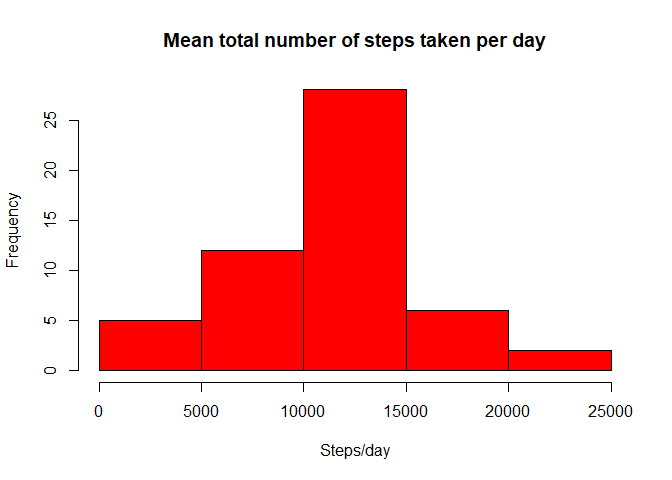
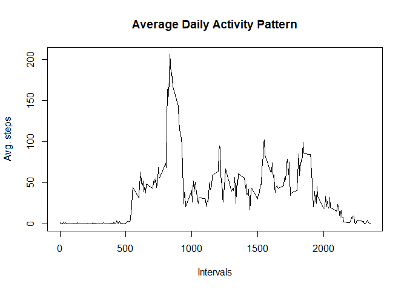
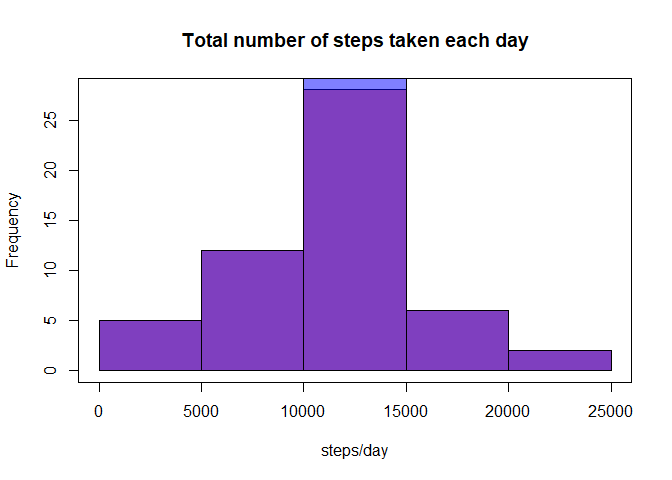
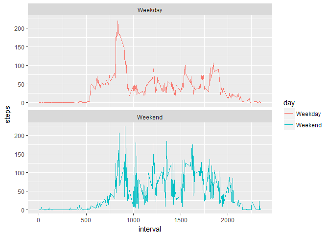

## Loading and preprocessing the data
1. Load the data and dplyr package

```r
library(dplyr)
```

```
## 
## Attaching package: 'dplyr'
```

```
## The following objects are masked from 'package:stats':
## 
##     filter, lag
```

```
## The following objects are masked from 'package:base':
## 
##     intersect, setdiff, setequal, union
```

```r
activity <- read.csv("activity.csv")
```
2. Convert the class of "date" from factor to date

```r
activity[,2] <- as.Date(activity$date, format= "%Y-%m-%d")
##Change language
Sys.setlocale("LC_TIME", "C")
```

```
## [1] "C"
```


## What is mean total number of steps taken per day?
1. Make a histogram of the total number of steps taken each day

```r
#Calculate the total number of steps taken per day 
steps_per_day <- tapply(activity$steps, activity$date, sum)

#Make a histogram
hist(steps_per_day, main= "Mean total number of steps taken per day", xlab= "Steps/day", col="red")
```

<!-- -->

2. Calculate and report the mean and median of the total number of steps taken per day

```r
mean_per_day <- mean(steps_per_day, na.rm=TRUE)
median_per_day <- median(steps_per_day, na.rm = TRUE)
```
The mean is 10766.19, and the median is 10765.

## What is the average daily activity pattern?
1. Make a time series plot (i.e. type = "l") of the 5-minute interval (x-axis) and the average number of steps taken, averaged across all days (y-axis)

```r
steps_per_interval <- activity %>%
        filter(!is.na(steps)) %>%
        group_by(interval) %>%
        summarize(steps = mean(steps))
plot(steps_per_interval, type="l", xlab="Intervals", ylab="Avg. steps", main="Average Daily Activity Pattern")
```

<!-- -->

2. Which 5-minute interval, on average across all the days in the dataset, contains the maximum number of steps? 

```r
max_steps <- arrange(steps_per_interval, desc(steps))
head(max_steps)
```

```
## # A tibble: 6 x 2
##   interval    steps
##      <int>    <dbl>
## 1      835 206.1698
## 2      840 195.9245
## 3      850 183.3962
## 4      845 179.5660
## 5      830 177.3019
## 6      820 171.1509
```
Interval 835 contains the maximum number of steps. 

## Imputing missing values
Note that there are a number of days/intervals where there are missing values (coded as NA). The presence of missing days may introduce bias into some calculations or summaries of the data.

1. Calculate and report the total number of missing values in the dataset (i.e. the total number of rows with NAs)

```r
missing_values <- sum(is.na(activity$steps))
print(missing_values)
```

```
## [1] 2304
```
There are total 2304 missing values. 

2. Devise a strategy for filling in all of the missing values in the dataset. The strategy does not need to be sophisticated. For example, you could use the mean/median for that day, or the mean for that 5-minute interval, etc.
3. Create a new dataset that is equal to the original dataset but with the missing data filled in.

```r
##Create a new dataset that is equal to the original dataset bu with the missing data filled in
activity_new <- activity
missing_data <- is.na(activity_new$steps)
mean_interval <- tapply(activity_new$steps, activity_new$interval, mean, na.rm=TRUE)
activity_new$steps[missing_data] <- mean_interval[as.character(activity_new$interval[missing_data])]

##Check the new dataset
head(activity_new)
```

```
##       steps       date interval
## 1 1.7169811 2012-10-01        0
## 2 0.3396226 2012-10-01        5
## 3 0.1320755 2012-10-01       10
## 4 0.1509434 2012-10-01       15
## 5 0.0754717 2012-10-01       20
## 6 2.0943396 2012-10-01       25
```
I used the mean for the 5-min interval to fill the NAs. 

4. Make a histogram of the total number of steps taken each day and Calculate and report the mean and median total number of steps taken per day. Do these values differ from the estimates from the first part of the assignment? What is the impact of imputing missing data on the estimates of the total daily number of steps?

```r
##Calculate the total number of steps taken each day with new dataset
steps_per_day2 <- tapply(activity_new$steps, activity_new$date, sum)

hist(steps_per_day, col=rgb(1,0,0,0.5), main="Total number of steps taken each day", xlab="steps/day")
hist(steps_per_day2, col=rgb(0,0,1,0.5), add=T)
box()
```

<!-- -->

```r
#Calculate the mean and median total number of steps taken per day.
mean_per_day2 <- mean(steps_per_day2, na.rm=TRUE)
median_per_day2 <- median(steps_per_day2, na.rm = TRUE)
```
Looking at the new histogram, calculated mean and median, we can state that the mean stayed the same, while median has increased a little when NAs were replaced (from 10765 to 10766.19; difference shown in lighter purple).

## Are there differences in activity patterns between weekdays and weekends?
1. Create a new factor variable in the dataset with two levels -- "weekday" and "weekend" indicating whether a given date is a weekday or weekend day.

```r
activity_new <- mutate(activity_new, day = ifelse(weekdays(activity_new$date) == c("Saturday", "Sunday"), "Weekend", "Weekday"))
activity_new$day <- as.factor(activity_new$day)
```

2. Make a panel plot containing a time series plot (i.e. type = "l") of the 5-minute interval (x-axis) and the average number of steps taken, averaged across all weekday days or weekend days (y-axis). The plot should look something like the following, which was created using simulated data:

```r
library(ggplot2)
steps_per_interval2 <- activity_new %>%
        group_by(interval, day) %>%
        summarize(steps = mean(steps))
i <- ggplot(steps_per_interval2, aes(x=interval, y=steps, color=day)) + geom_line() + facet_wrap(~day, ncol = 1, nrow=2)
print(i)
```

<!-- -->

As we can see from two plots, more patterns (up and downs) were shown during the weekend. During weekdays, the highest point was in earlier of the day. During weekends, lines are slightly shifted to right (compared to weekdays).  
